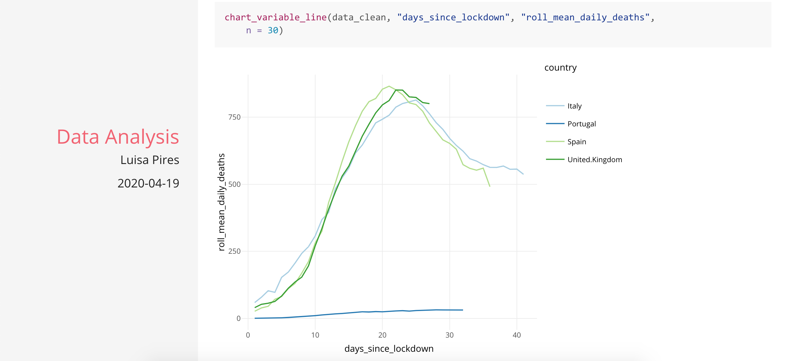

This Markdown an example of an analysis using the daily country data on number of deaths, recovered and confirmed cases of COVID 19. 

Here we focus on Portugal, Spain, UK and Italy. Analysis performed:

1. Daily differences (absolute,  percentage and 7-day rolling average)
2. % differences in accumulated data 
3. indicators per million inhabitants
4. Analysis of reference points (days since lockdown, days since 50th death reported)

Data from John Hopkins with thanks:
https://github.com/pomber/covid19
https://github.com/CSSEGISandData/COVID-19

"This is the data repository for the 2019 Novel Coronavirus Visual Dashboard operated by the Johns Hopkins University Center for Systems Science and Engineering (JHU CSSE). Also, Supported by ESRI Living Atlas Team and the Johns Hopkins University Applied Physics Lab (JHU APL)."

